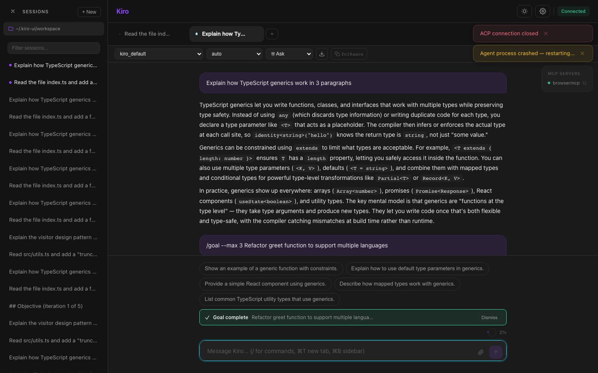
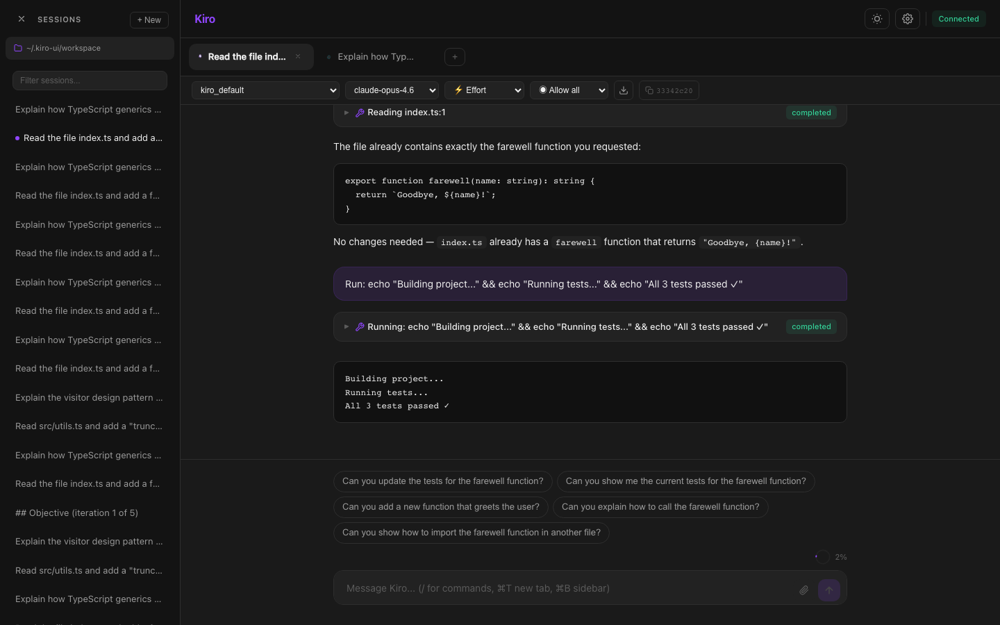
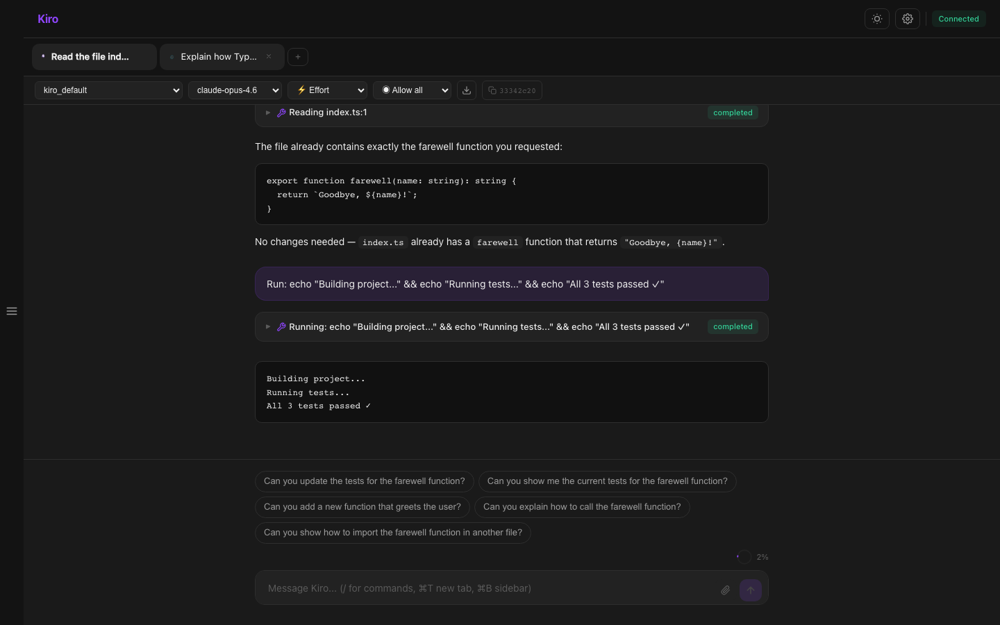
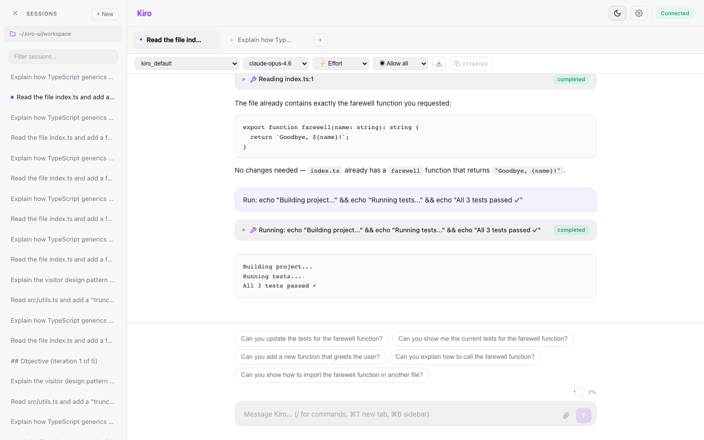
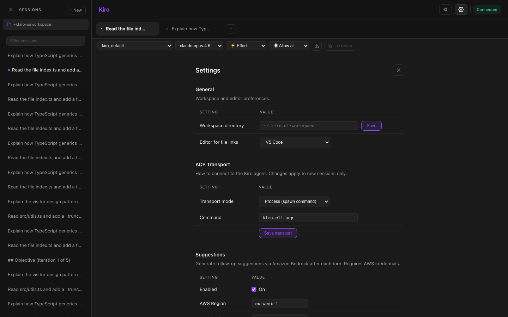
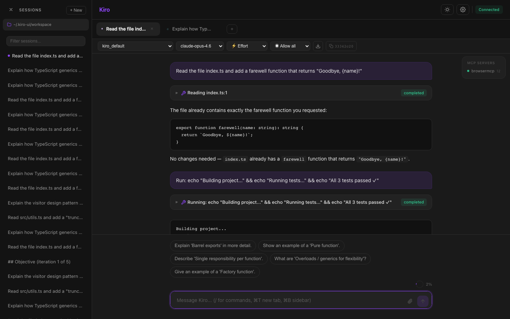

# Kiro UI — Feature Guide

A complete visual walkthrough of every feature.

---

## 1. Empty State — Agent Description

New session shows the active agent's name and description. The sidebar displays workspace path and session history.

---

## 2. Per-Tab Configuration

Each tab has independent settings: agent, model, permission policy. Changes only affect the active tab.

---

## 3. Effort Control

Reasoning effort dropdown (low → max). Only appears when the current model supports it (e.g., Claude). Probed dynamically.

---

## 4. Real-Time Streaming

Responses stream with full markdown rendering. Cancel button (■) stops generation. Ghost mascot floats while working.

---

## 5. Tool Calls & File Follow-Along

Tool blocks show agent actions with status. The **Files panel** (top-right) tracks which files are being read/edited in real-time.

---

## 6. Tool Block Expanded — Diffs

Click to expand. File edits show side-by-side diffs. Clickable file paths open in your editor. Raw I/O for debugging.

---

## 7. Real-Time Shell Streaming

Shell commands stream output line-by-line as they execute. Green terminal text inside the tool block.

---

## 8. Context & Metering

Pie chart shows context window consumption. Cumulative token usage and cost displayed inline. At 50%+, compact button (⊘) appears.

---

## 9. Message Actions

Hover any message: **Copy** on all, **Rewind** on user messages, **Retry** on failure only.

---

## 10. Rewind — Conversation Branching

Timeline picker shows all turns with enriched summaries (tool count, files touched, commands run). Click to branch.

---

## 11. Multi-Tab Sessions

Each tab = one session. Independent agent, model, permissions. Tab names auto-sync from session titles. ⌘T to add.

---

## 12. Slash Commands

Type `/` for autocomplete. Dynamic subcommand options fetched from agent. Includes `/rewind`, `/effort`, `/compact`, `/mcp`, `/goal`.

---

## 13. Message Queue

Always-on when agent is running. Messages stack with reorder (↑↓), merge (⊕), edit, delete, clear all, and Send Now.

---

## 14. Goal Iterations

`/goal` command starts an iterative agent loop. Banner shows iteration progress (e.g., "2/5"), goal text, and cancel button.

---

## 15. Session History

Workspace-scoped. Open sessions marked with dot. Title filter for search. Click to load in current tab.

---

## 16. Keyboard Shortcuts

⌘N new chat, ⌘T new tab, ⌘B toggle sidebar, ⌘L clear, Escape cancel.

---

## 17. Light Theme

Sun/moon toggle. Persists across sessions and reloads.

---

## 18. Settings

Editor integration (VS Code, Cursor, IntelliJ), workspace, suggestions config, permissions, limits, protocol debug.

---

## 19. Follow-Up Suggestions

AI-generated next actions appear as clickable chips after each response. Configurable model, count, and AWS profile.

---

## 20. Chat Export

Download button exports the conversation as a formatted `.md` file named after the session.

---

## Additional Features

| Feature | Description |
|---------|-------------|
| Agent Plan | Live task list (○ pending, ▶ in-progress, ✓ completed) during multi-step tasks |
| Subagent Pipelines | Visual panel tracking multi-agent orchestration with stage status |
| MCP Server Panel | Status dots, tool lists, OAuth authentication flow |
| Permission Prompts | Interactive allow/deny with persistent trust rules |
| Crash Auto-Reconnect | Detects dead agent, auto-restarts within 1 second |
| TCP Transport | Connect to remote `kiro-cli acp` over TCP (for Docker/remote) |
| Electron Desktop | Native macOS/Windows/Linux app |
| Protocol Debug | Raw JSON-RPC traffic inspection when enabled |
