# Kiro UI — Feature Guide

A visual walkthrough of Kiro UI's features.

---

## Initial load

The app loads with a connected status, ready to chat. The sidebar shows conversation history.

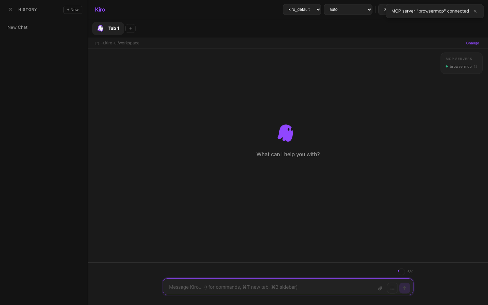

---

## Agent selection

Select from available agents. Each agent has different capabilities and specializations.

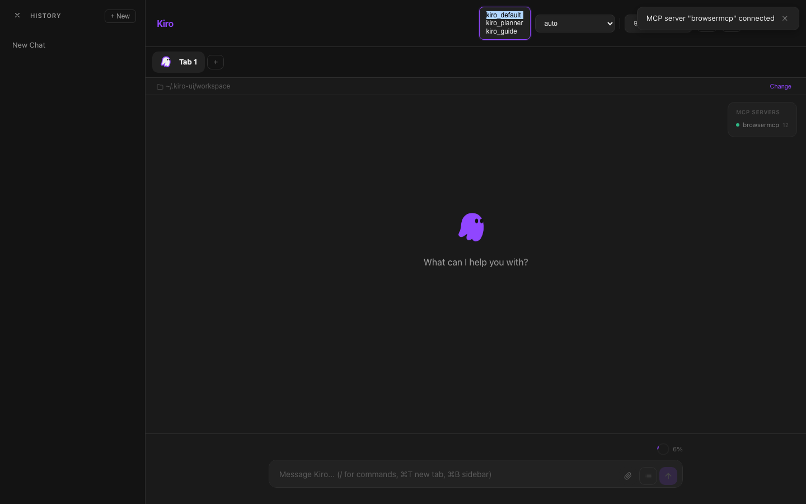

---

## Model selection

Choose the AI model — Claude Sonnet, Opus, Haiku, DeepSeek, and more.

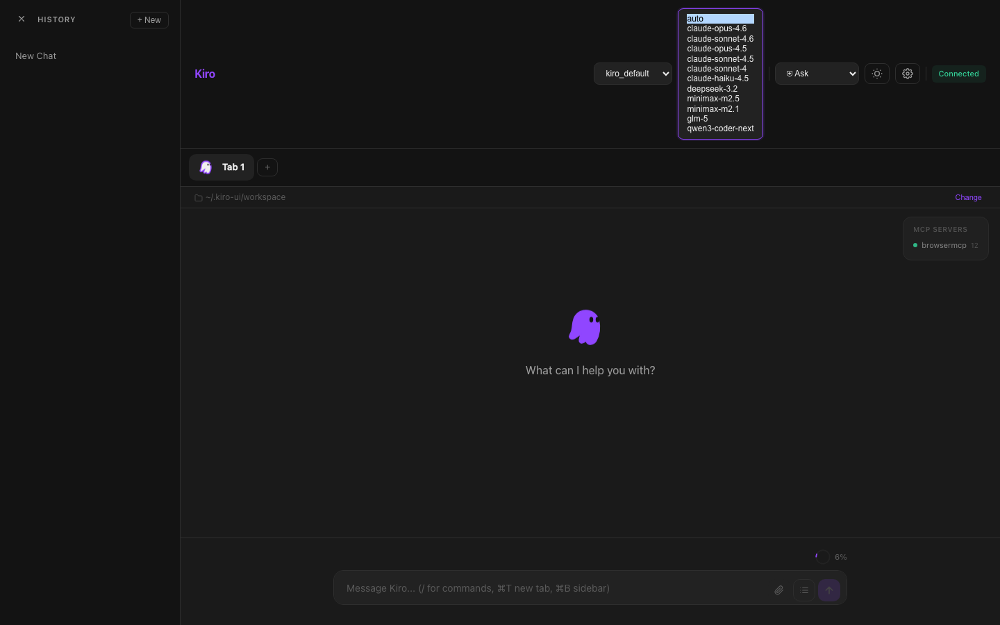

---

## Permission modes

Three permission modes: **Ask** (safest), **Auto-reads** (reads auto-approved), **Allow all** (fastest).

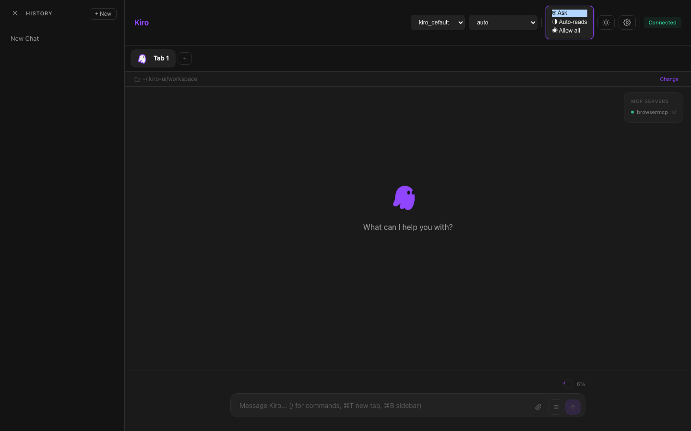

---

## Typing message

Type your message. Use Shift+Enter for new lines, Enter to send.

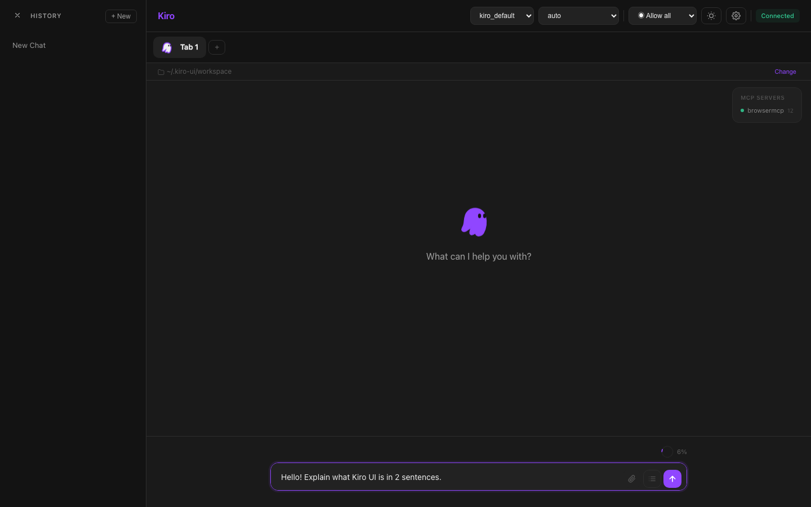

---

## Agent streaming

The agent streams its response in real-time. A cancel button appears to stop generation.

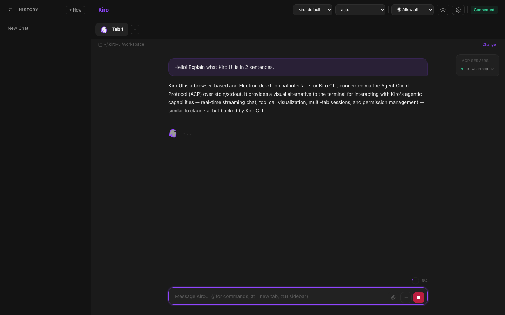

---

## Agent response

Completed response with full markdown rendering — code blocks, lists, and formatting.

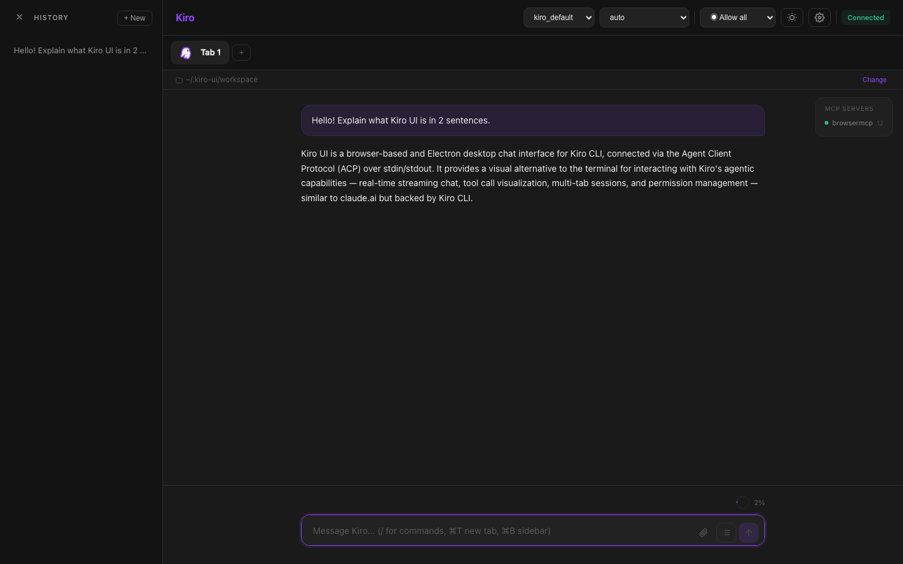

---

## Tool call pending

When the agent uses tools, tool call blocks appear with a pending status.

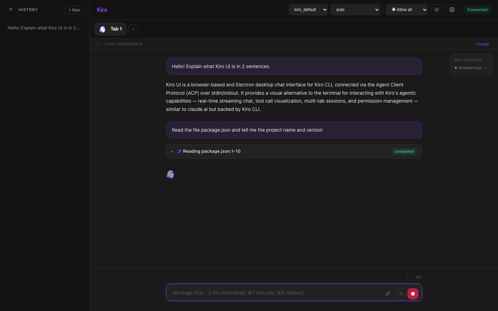

---

## Tool call expanded

Click a tool block to expand it and see the full input/output, including file diffs.

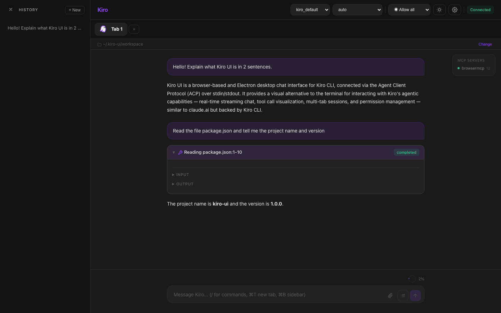

---

## Multi tab

Each tab runs an independent agent session with its own context. Click + to add tabs.

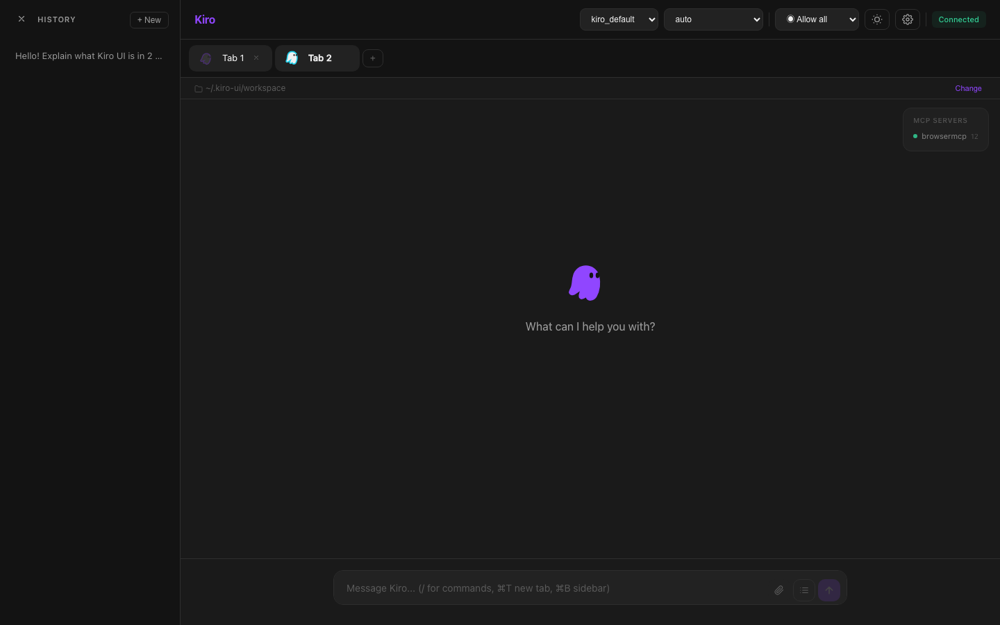

---

## Slash commands

Type / to see available commands with autocomplete.

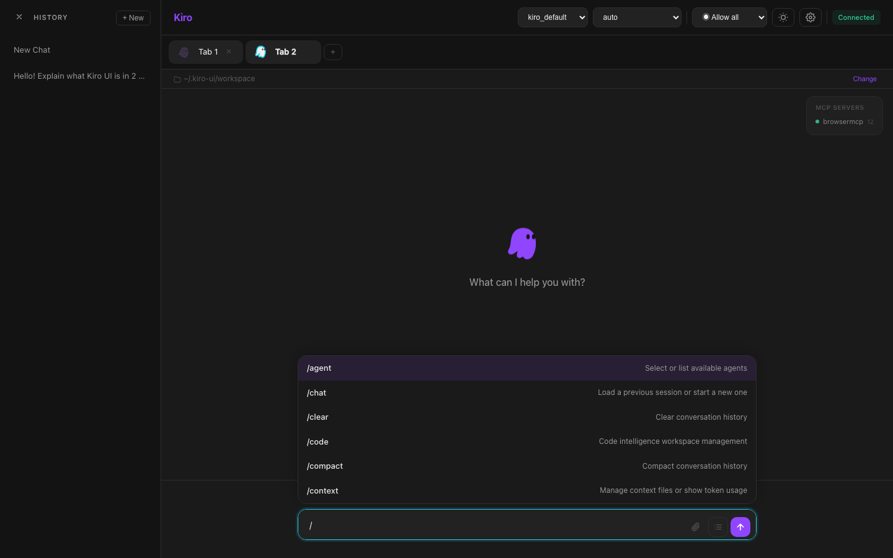

---

## Light theme

Toggle between dark and light themes. Preference is persisted.

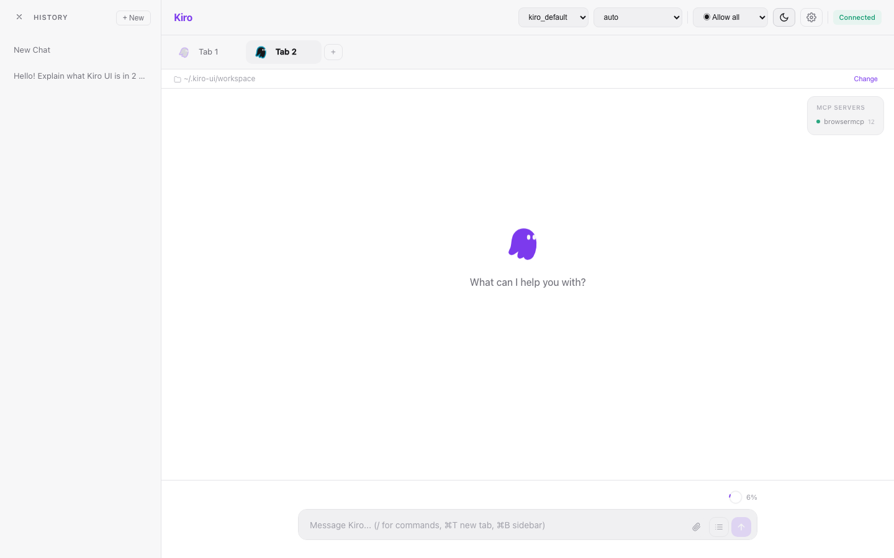

---

## Settings page

Configure editor, workspace, permission policies, resource limits, and agent settings.

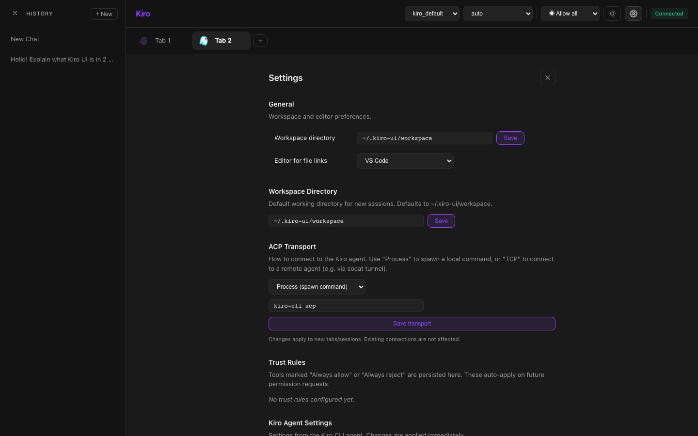

---

